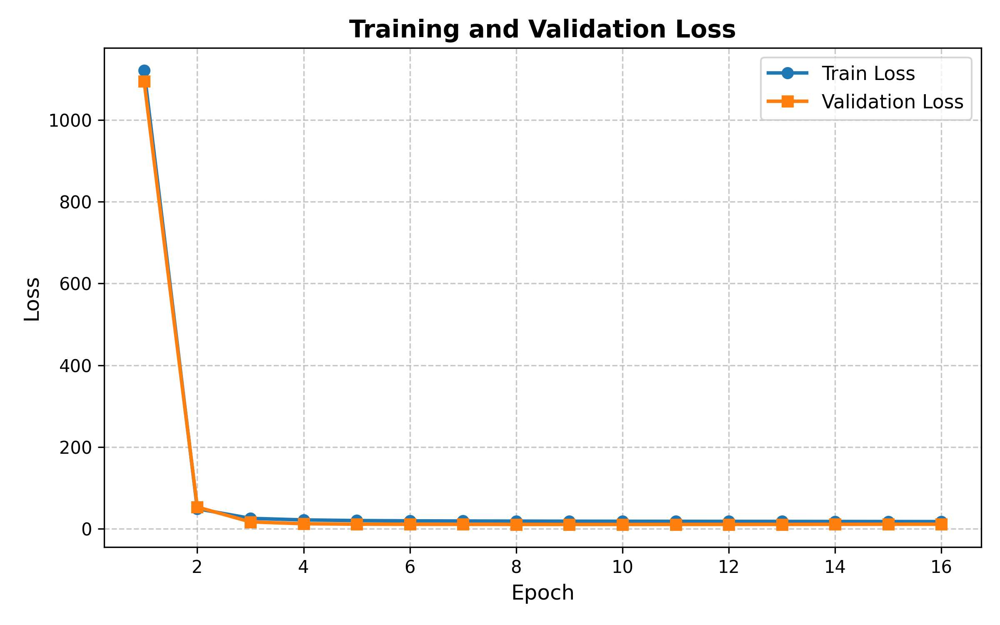
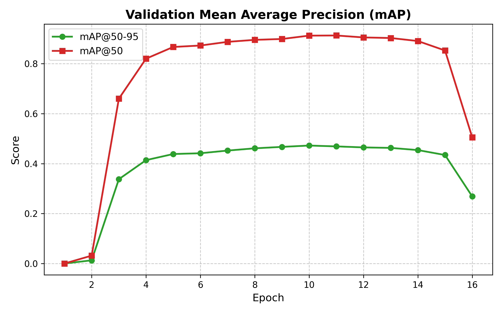

# Digit Detection Problem - RT-DETRv2 🚀
**NYCU Visual Recognition using Deep Learning (Spring 2026) - Homework 2**

[](https://www.codabench.org/)
[](https://github.com/lyuwenyu/RT-DETR)
[](https://pytorch.org/)

This repository contains the official implementation for the Digit Detection Problem (Homework 2). By leveraging the **RT-DETRv2** architecture with a **ResNet-50** backbone, this project successfully secured **Rank 1** on the NYCU Visual Recognition Course (Spring 2026) Homework 2 CodaBench competition leaderboard with a Test score of **0.41**.

---

## 📌 Project Summary

The core objective of this project is to localize and classify multiple digits in dense environments. To maximize performance under strict course constraints, we implemented several key strategies:

- **Rectangular Training ($320 \times 640$):** We adapted the input resolution to preserve the widescreen aspect ratio of the dataset, preventing vertical feature distortion.
- **Bipartite Matching Loss Analysis:** We explored the impact of the End-of-Sequence (`eos_coef`) background penalty to understand the balance between local precision and test-set generalization.
- **Advanced Regularization:** Implementation of **Random Erasing**, **OneCycleLR** scheduling, and **Exponential Moving Average (EMA)** for model weights to ensure stable convergence.

---

## 📊 Results & Experimental Analysis

We evaluated 14 distinct configurations to bridge the gap between local validation and the unseen CodaBench test set.

| Experimental Group | Queries ($q$) | Base LR | Batch Size | Weight Decay | Local mAP | CodaBench Score |
| :--- | :---: | :---: | :---: | :---: | :---: | :---: |
| **🏆 Best Model** | **1000** | **$1 \times 10^{-4}$** | **24** | **$5 \times 10^{-4}$** | **0.4497** | **0.41** |
| Baseline (Standard) | 1000 | $1 \times 10^{-4}$ | 16 | $1 \times 10^{-3}$ | 0.4630 | 0.40 |
| High Penalty Exp | 1000 | $1 \times 10^{-4}$ | 32 | $1 \times 10^{-3}$ | 0.4717 | 0.37 |
| Query Variant ($q300$)| 300 | $1 \times 10^{-4}$ | 16 | $5 \times 10^{-4}$ | 0.4468 | 0.39 |

> **Key Finding:** While increasing the background penalty (`eos_coef = 1e-3`) yielded a superior local mAP of **0.47**, it caused a performance drop on CodaBench. This suggests that a more balanced regularization approach is necessary to handle noisy annotations in the test set.

---

## 📈 Training Dynamics

The learning curves below demonstrate the training progression of our optimized configuration.

<p align="center">
  
  
</p>

---

## 🛠️ Usage Guide

### 1. Requirements
Install the necessary packages via pip:
```bash
pip install -r requirements.txt
```

### 2. How to Run Training
There are two primary methods to execute training depending on your hardware environment.

#### Option A: Using `train.py` (Direct Execution)
Best for single-GPU setups or debugging. This provides direct access to Python's error logs and single-process execution.

```bash
python train.py --run_name --batch_size --epochs --lr --wd --queries --gpu --workers --eof --data_path --save_path
```

#### Option B: Using `train.sh` (Distributed Execution)
Best for Multi-GPU setups (e.g., Dual RTX 4090). Generate output name based on the parameters it used.

```bash
bash train.sh --batch_size --epochs --lr --wd --queries --gpu --workers --eof
```

### 🔍 Differences: `train.py` vs `train.sh`

| Aspect | train.py | train.sh |
|--------|---------|----------|
| Execution | Single-process | Multi-process (DDP) |
| Hardware | Single GPU / CPU | Multiple GPUs |
| Performance | Slower for large datasets | Maximum speed via parallelization |
| Use Case | Debugging and testing | Production-level training |

---

## 👤 Author
Muhammad Rayhan Athaillah (賴瑞涵)  
Student ID: 313540001  
Affiliation: National Yang Ming Chiao Tung University (NYCU)
